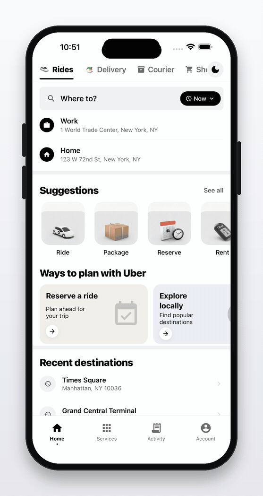

# device-gif-maker

**Any flow → a clean looping GIF on a pristine device frame.**

Drop a few steps in a YAML file, point it at your app, and get back a polished,
seamlessly-looping GIF (and an MP4) of the flow running on a **real cloud
device** — framed in a clean phone mockup, ready for a README or a tweet.

No screen recorder, no Figma, no After Effects, no mockup PNGs. Just the
[Revyl CLI](https://docs.revyl.ai) + `ffmpeg`.



> *Generated from [`flows/ubert.yaml`](flows/ubert.yaml) — Home → search → "Times Square" → live ride options — in one command.*

---

## Why

Devs need flow GIFs for READMEs and launch tweets constantly, and making them
is annoying: record your screen, trim it, find a device-frame template, mask
the corners, line it up, export, loop it. This does all of that from a text
file, and reruns deterministically when the UI changes.

It's built the same way as the rest of
[RevylAI/mobile-devtools](https://github.com/RevylAI/mobile-devtools):
a small Python CLI orchestrating `revyl device` commands.

## How it works

1. **Run** — starts a cloud device session and walks your flow
   (`revyl device tap/type/swipe/navigate/instruction …`).
2. **Capture** — grabs a screenshot at every UI state you mark.
3. **Frame** — composites each screenshot into a pristine, asset-free phone
   mockup (rounded screen, thin bezel, Dynamic Island / notch / hole-punch,
   side buttons, soft drop shadow) on a clean background.
4. **Loop** — builds a smooth timeline (per-state holds + crossfade tweens +
   a seamless crossfade from the last state back to the first) and encodes a
   high-quality GIF (ffmpeg `palettegen`/`paletteuse`) plus an MP4.

> The capture primitive is `revyl device screenshot`, so the GIF is a polished
> **state-to-state** loop — one frame per UI state, held and crossfaded — not a
> raw 60fps capture. That's exactly the look most good README/tweet GIFs have.

## Install

```bash
git clone https://github.com/ethanzhoucool/device-gif-maker.git
cd device-gif-maker

pip install -r requirements.txt          # Pillow + PyYAML
brew install ffmpeg                       # if you don't have it
revyl auth login                          # authenticate the Revyl CLI

# optional: put it on your PATH
ln -s "$PWD/revyl-gif" /usr/local/bin/revyl-gif
```

## Usage

```bash
revyl-gif flows/example.yaml                  # full run on a fresh cloud device
revyl-gif flows/example.yaml --attach <id>    # reuse a session you already have
revyl-gif flows/example.yaml --dry-run        # re-render from captured frames only
```

Outputs land in `out/<flow-name>/`:

```
out/search-and-play/
  frames/        # raw device screenshots, one per state (+ manifest.json)
  seq/           # the rendered timeline (held + crossfaded frames)
  search-and-play.gif
  search-and-play.mp4
  preview.html   # a self-contained viewer — opens automatically in a TTY
```

Every run compiles a **`preview.html`** next to the outputs (the GIF looping +
the MP4 autoplaying, side by side) and opens it in your browser. Pass
`--no-open` to skip the auto-open, or `--open` to force it (e.g. from a script).

### Iterate for free with `--dry-run`

The expensive part is the cloud device. Once a run has captured
`out/<name>/frames/`, you can re-render the GIF as many times as you like —
tweaking the frame color, background, hold timing, crossfade, etc. — **without
touching a device**:

```bash
revyl-gif flows/example.yaml --dry-run --color silver --background midnight --hold 1.6
```

Per-state holds and labels are restored from the capture's
`frames/manifest.json`, so a re-render's timing matches the live run. Pass an
explicit `--hold` to flatten every state to a single duration instead.

## Flow spec

A flow is a YAML (or JSON) file. The only required parts are `app` and `steps`.

```yaml
name: search-and-play
platform: ios

app:
  app_id: "…"            # latest build for an app  (or app_url / build_version_id / app_link)

# device_model: "iPhone 16 Pro"     # optional pin
# os_version: "iOS 26.2"

frame:
  style: iphone-pro        # iphone-pro | iphone | android
  color: black             # black | graphite | silver | white
  background: light        # light | dark | midnight | white | transparent | "#rrggbb"
  shadow: true
  width: 440               # rendered screen width in px

output:
  gif: true
  mp4: true
  fps: 30
  hold: 1.3                # default seconds each state is held
  xfade: 0.45              # crossfade seconds between states
  loop: true               # seamless wrap from last state → first
  pingpong: false          # play forward then back instead of wrapping

capture:
  initial: true            # capture the opening state before step 1
  settle: 0.6              # seconds to wait after each action before screenshotting
  dedup: true              # merge identical consecutive states into one longer hold

steps:
  - tap: { target: "Search tab" }
    label: "open search"
    hold: 1.0                       # per-state hold override
  - tap: { target: "search field" }
    capture: false                  # do the action but skip this frame
  - type: { target: "search field", text: "Daft Punk" }
  - key: ENTER
    hold: 1.4
  - tap: { target: "first song in the results list" }
  - tap: { target: "play button" }
    hold: 2.0
```

### Step actions

Each step has **one** action key plus optional control keys
(`capture`, `hold`, `label`, `settle`). Targets are natural language
(`target:`) — grounded on the live UI by the Revyl agent — or coordinates
(`x:` / `y:`).

| Action | Example |
| --- | --- |
| `tap` | `tap: { target: "Sign In" }` |
| `double_tap` | `double_tap: { x: 200, y: 400 }` |
| `long_press` | `long_press: { target: "photo", duration: 1.0 }` |
| `type` | `type: { target: "email", text: "a@b.com" }` |
| `clear_text` | `clear_text: { target: "search field" }` |
| `swipe` | `swipe: { target: "card", direction: "left" }` |
| `drag` | `drag: { start_x: 100, start_y: 800, end_x: 300, end_y: 800 }` |
| `pinch` | `pinch: { target: "map", scale: 2.0 }` |
| `navigate` | `navigate: "myapp://profile/42"` |
| `launch` | `launch: "com.example.app"` |
| `open_app` | `open_app: "settings"` |
| `back` / `home` | `back: true` |
| `key` | `key: ENTER` |
| `shake` | `shake: true` |
| `wait` | `wait: 1500`  (ms) |
| `instruction` | `instruction: "log in and open the dashboard"` |

### Control keys

- **`capture`** *(default `true`)* — capture a frame after this step. Set
  `false` on setup steps you don't want in the GIF.
- **`hold`** — seconds to hold this state in the loop (overrides `output.hold`).
- **`label`** — a name shown in the run log and used for the frame filename.
- **`settle`** — seconds to wait after the action before the screenshot
  (overrides `capture.settle`).

## CLI overrides

Anything in `frame` / `output` can be overridden on the command line, which
pairs nicely with `--dry-run`:

```
--style {iphone-pro,iphone,android}   --color {black,graphite,silver,white}
--background <preset|#hex>            --width <px>
--fps <n>  --hold <s>  --xfade <s>
--no-shadow  --pingpong  --no-loop  --no-gif  --no-mp4
--attach <session-id>  --keep-session  --timeout <s>  --out <dir>
```

## Requirements

- [Revyl CLI](https://docs.revyl.ai), authenticated (`revyl auth login`)
- `ffmpeg` on your PATH
- Python 3.9+ with `Pillow` and `PyYAML`

## License

MIT — fork it, ship it.
